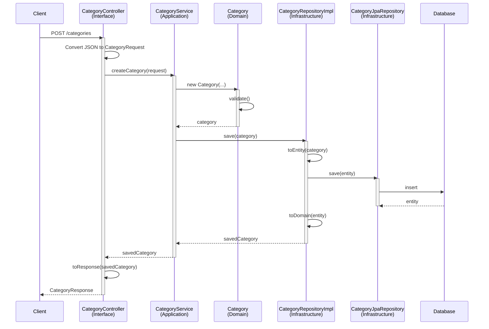
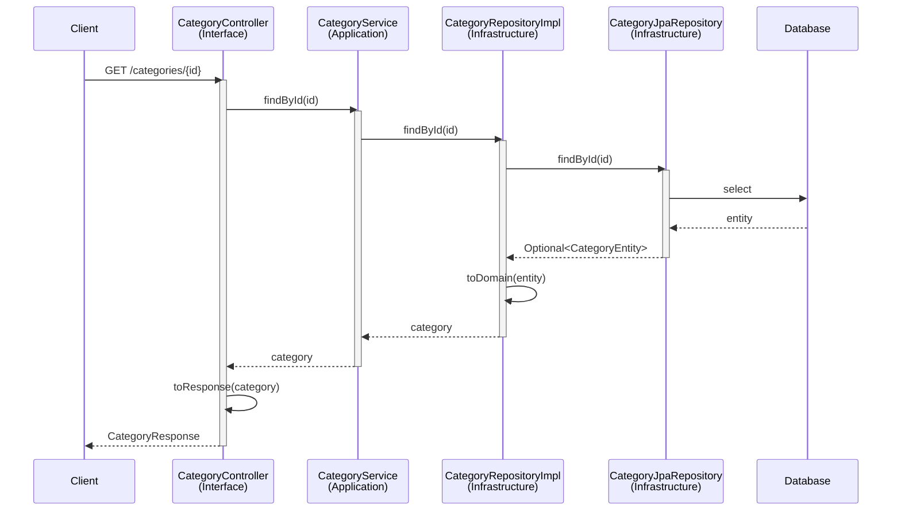

# Money Keeper - Personal Finance Management

A Spring Boot application implementing Domain Driven Design (DDD) principles for personal finance management. The system helps users track their income and expenses through categorized transactions.

## Project Overview

This project follows Clean Architecture and Domain-Driven Design principles to maintain a clear separation of concerns and business logic isolation.

## Domain-Driven Design Implementation

The project is structured following DDD tactical patterns:

### 1. Domain Layer
- **Entities & Value Objects**: Core business objects like `Category`
- **Domain Services**: Core business logic
- **Repository Interfaces**: Defines persistence contracts
- Location: `com.personal.money.management.core.*.domain`

### 2. Application Layer
- **Application Services**: Orchestrates use cases
- **DTOs**: Data transfer objects for the application layer
- Location: `com.personal.money.management.core.*.application`

### 3. Infrastructure Layer
- **Persistence**: JPA entities and repositories
- **External Services**: Integration with external systems
- Location: `com.personal.money.management.core.*.infrastructure`

### 4. Interface Layer
- **REST Controllers**: API endpoints
- **Request/Response DTOs**: Data transfer objects for the API
- Location: `com.personal.money.management.core.*.interfaces`

## Project Structure

```
money-keeper/
├── src/
│   ├── main/
│   │   ├── java/
│   │   │   └── com/
│   │   │       └── personal/
│   │   │           └── money/
│   │   │               └── management/
│   │   │                   └── core/
│   │   │                       ├── PersonalMoneyManagementApplication.java
│   │   │                       ├── category/
│   │   │                       │   ├── application/
│   │   │                       │   ├── domain/
│   │   │                       │   │   ├── model/
│   │   │                       │   │   └── repository/
│   │   │                       │   ├── infrastructure/
│   │   │                       │   │   └── persistence/
│   │   │                       │   └── interfaces/
│   │   │                       └── transaction/
│   │   └── resources/
│   │       └── application.properties
│   │   └── resources
│   │       ├── application.properties
│   │       └── db
│   │           └── migration
│   │               └── V1__init.sql
│   └── test
│       └── java
│           └── com
│               └── example
│                   └── category
│                       └── CategoryApplicationTests.java
├── pom.xml
└── README.md
```

## Key DDD Concepts Implemented

### 1. Aggregates
- **Category Aggregate**: Manages category hierarchy and validates business rules
- Root: `Category`
- Invariants: Category type consistency, valid parent-child relationships

### 2. Repository Pattern
- Domain repositories define interfaces (`CategoryRepository`)
- Infrastructure implements persistence (`CategoryRepositoryImpl`, `CategoryJpaRepository`)
- Clear separation between domain and persistence concerns

### 3. Value Objects
- `CategoryType`: Represents the type of a category (INCOME/EXPENSE)
- Immutable and self-validating

## Setup Instructions

1. **Prerequisites**
   - Java 17 or higher
   - Maven 3.8+
   - MySQL 8.0+

2. **Database Configuration**
   ```properties
   spring.datasource.url=jdbc:mysql://localhost:3306/money_keeper
   spring.datasource.username=your_username
   spring.datasource.password=your_password
   ```

3. **Build & Run**
   ```powershell
   # Build the project
   mvn clean install

   # Run the application
   mvn spring-boot:run
   ```

## API Reference

### Categories API

#### Create Category
```http
POST /api/categories
Content-Type: application/json

{
  "name": "Groceries",
  "icon": "shopping_cart",
  "type": "EXPENSE",
  "parentId": null
}
```

#### Get Category
```http
GET /api/categories/{id}
```

## Design Decisions

1. **Repository Interface in Domain Layer**
   - Keeps domain logic pure and independent
   - Allows different persistence implementations
   - Follows Interface Segregation Principle

2. **Mapper Pattern**
   - Separates domain models from persistence
   - Prevents JPA annotations in domain objects
   - Maintains clean domain model

3. **Value Objects**
   - Encapsulates validation
   - Ensures data integrity
   - Improves domain model expressiveness

- **Domain**: Business logic and core models ([`Category`](src/main/java/com/personal/money/management/core/category/domain/model/Category.java), [`CategoryType`](src/main/java/com/personal/money/management/core/category/domain/model/CategoryType.java), [`CategoryRepository`](src/main/java/com/personal/money/management/core/category/domain/repository/CategoryRepository.java))
- **Application**: Application services ([`CategoryService`](src/main/java/com/personal/money/management/core/category/application/CategoryService.java))
- **Infrastructure**: Persistence implementation ([`CategoryJpaRepository`](src/main/java/com/personal/money/management/core/category/infrastructure/persistence/CategoryJpaRepository.java))
- **Interfaces**: API controllers and DTOs ([`CategoryController`](src/main/java/com/personal/money/management/core/category/interfaces/api/CategoryController.java), [`CategoryRequest`](src/main/java/com/personal/money/management/core/category/interfaces/api/dto/CategoryRequest.java), [`CategoryResponse`](src/main/java/com/personal/money/management/core/category/interfaces/api/dto/CategoryResponse.java))

## Layer Communication and Dependency Flow

### Architecture Flow
```
┌─────────────┐     ┌─────────────┐     ┌─────────────┐
│  Interface  │ --> │ Application │ --> │   Domain    │
│    Layer    │     │    Layer    │     │    Layer    │
└─────────────┘     └─────────────┘     └─────────────┘
                          ↑                    ↑
                          │                    │
                          │              ┌─────────────┐
                          └─────────────-│Infrastructure│
                                        │    Layer    │
                                        └─────────────┘
     REST           Services/DTOs      Entities/Rules    Data Access
   Controllers      Infrastructure        Interfaces     Implementations
                    Dependencies

```

### Sequence Diagrams

1. **Create Category Flow**


2. **Get Category Flow**


These sequence diagrams illustrate:
- Clear layer boundaries
- Data transformation points
- Flow of control and data
- Interaction between components
- Domain model protection
- Infrastructure abstraction

### Layer Dependencies

1. **Interface Layer → Application Layer**
   - Controllers depend on Application Services
   - Example: `CategoryController` uses `CategoryService`
   - Converts HTTP requests to application DTOs
   ```java
   @RestController
   public class CategoryController {
       private final CategoryService categoryService;
       // Controller uses application service
   }
   ```

2. **Application Layer → Domain Layer & Infrastructure**
   - Services operate on domain entities
   - Uses repository interfaces from domain
   - Uses infrastructure implementations through dependency injection
   - Example: `CategoryService` uses both domain and infrastructure
   ```java
   @Service
   public class CategoryService {
       private final CategoryRepository categoryRepository; // Domain interface
       
       public CategoryService(CategoryRepositoryImpl repositoryImpl) { // Infrastructure implementation
           this.categoryRepository = repositoryImpl;
       }
       
       public Category createCategory(Category category) {
           // Uses infrastructure through domain interface
           return categoryRepository.save(category);
       }
   }
   ```

3. **Infrastructure Layer → Domain Layer**
   - Implements domain repository interfaces
   - No domain layer dependency on infrastructure
   - Example: `CategoryRepositoryImpl` implements `CategoryRepository`
   ```java
   @Repository
   public class CategoryRepositoryImpl implements CategoryRepository {
       private final CategoryJpaRepository jpaRepository;
       // Infrastructure implements domain interface
   }
   ```

### Key Points About Data Flow

1. **Each Layer's Responsibility**
   - Interface Layer: HTTP ↔ DTOs
   - Application Layer: DTOs ↔ Domain Objects
   - Infrastructure Layer: Domain Objects ↔ Entities

2. **Data Integrity**
   - Domain validation happens before persistence
   - Entity mapping preserves all data
   - Consistent object state across transformations

3. **Error Handling**
   - Domain validation errors propagate up
   - Infrastructure errors are wrapped in domain exceptions
   - Each layer can add its own error context

## License

This project is licensed under the MIT License.