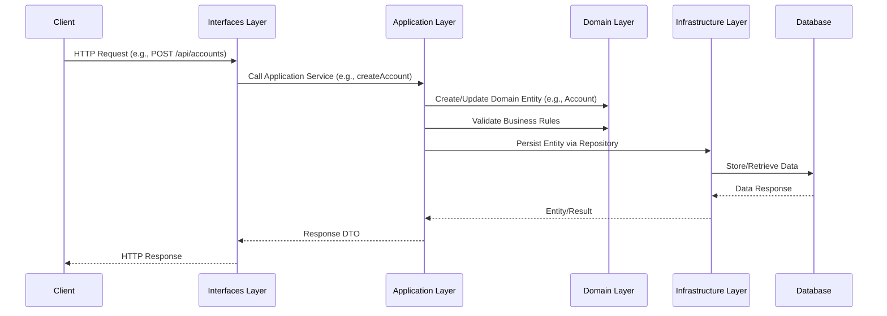
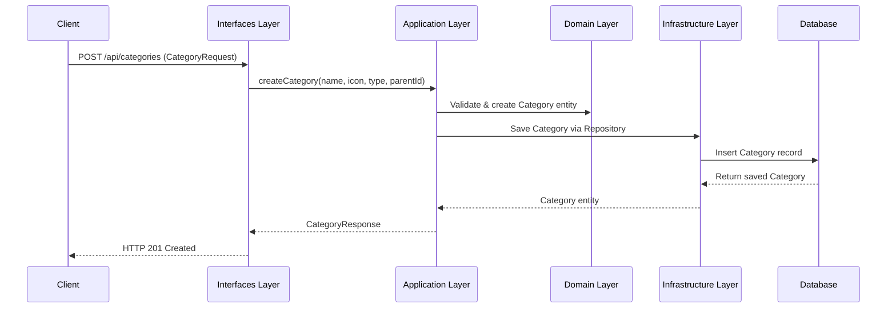
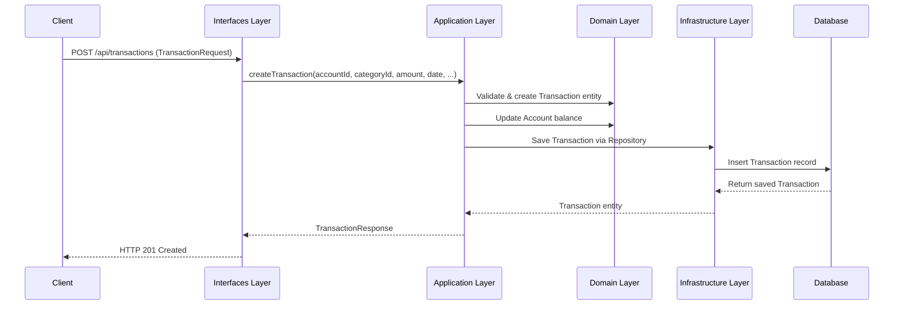
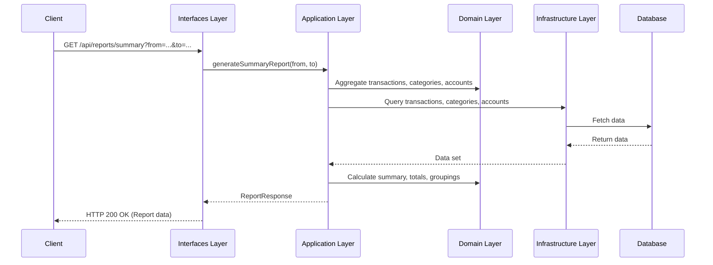

# Software Requirements Specification (SRS)

## Money Keeper Project

### 1. Introduction

#### 1.1 Purpose
Money Keeper is a personal finance management system that allows users to manage accounts, categorize expenses/income, and (upcoming) record transactions. This SRS defines the requirements for the backend, frontend, and E2E testing, including the planned transactions feature.

#### 1.2 Scope
- **Backend**: Java 18, Spring Boot, DDD architecture, Oracle DB.
- **Frontend**: Vue 3, Vite, TypeScript.
- **E2E**: Playwright + Cucumber (TypeScript).
- **Planned**: Transaction management (recording, listing, and categorizing transactions).

#### 1.3 Definitions
- **Account**: Represents a financial account (e.g., cash, bank, credit card).
- **Category**: Grouping for transactions (e.g., Food, Salary).
- **Transaction**: (Planned) A record of money movement, linked to an account and category.

---

### 2. Overall Description

#### 2.1 Product Perspective
- Modular, layered DDD architecture.
- RESTful APIs for all operations.
- Frontend communicates with backend via HTTP.
- E2E tests validate user flows.

#### 2.2 User Classes
- **End User**: Manages accounts, categories, and transactions.
- **Admin/Developer**: Maintains system, runs tests, deploys updates.

#### 2.3 Operating Environment
- Dockerized for local/dev/prod.
- Oracle DB for persistence.
- Node.js for frontend and E2E.

---

### 3. System Features

#### 3.1 Account Management
- Create, update, delete, and list accounts.
- Account fields: name, initial balance, type (cash, bank, credit), currency, description.
- Validation: required fields, positive balance, max lengths.

#### 3.2 Category Management
- Create, update, delete, and list categories.
- Categories can be hierarchical (parent/child).
- Fields: name, icon, type (expense/income), parent.
- Validation: no cyclic parent, unique name, max lengths.

#### 3.3 Transaction Management (Upcoming)
- **Create Transaction**: User can record a transaction, specifying account, category, amount, date, and description.
- **List Transactions**: User can view transactions, filter by account, category, date range.
- **Update/Delete Transaction**: User can modify or remove a transaction.
- **Validation**: Amount must be positive, account/category must exist, date must be valid.
- **Business Rules**:
  - Account balance updates accordingly.
  - Category type (expense/income) must match transaction type.
  - Prevent overdraft if account does not allow negative balances.

---

### 4. External Interface Requirements

#### 4.1 API Endpoints
- `/api/accounts` (GET, POST, PUT, DELETE)
- `/api/categories` (GET, POST, PUT, DELETE)
- `/api/transactions` (Planned: GET, POST, PUT, DELETE)

#### 4.2 Frontend
- Responsive UI for all CRUD operations.
- Transaction entry form (planned).
- Category and account selectors.

#### 4.3 E2E Testing
- Feature files for all user flows.
- Step definitions in TypeScript.
- Reports and screenshots for test runs.

---

### 5. Non-Functional Requirements

- **Performance**: API should respond within 1s for standard operations.
- **Security**: Input validation, error handling, no sensitive data exposure.
- **Reliability**: Unit and integration tests for all business logic.
- **Maintainability**: DDD structure, clear separation of concerns.
- **Portability**: Dockerized, works on Windows, Linux, macOS.

---

### 6. Future Work

- **Transactions**: Full CRUD, reporting, and analytics.
- **User Authentication**: (Future) Secure user accounts.
- **Budgeting**: (Future) Set and track budgets per category.

---

### 7. Appendices

- See `backend/DDD.md` for DDD principles and glossary.
- See `backend/README.md` and `e2e/README.md` for build, run, and test instructions.

---

### 8. DDD Layered Architecture

The Money Keeper backend is built using Domain-Driven Design (DDD) principles, emphasizing a clear separation of concerns and a focus on the core business domain. The architecture is organized into four distinct layers:

#### 8.1 Layer Overview

- **Interfaces Layer**
  - Purpose: Entry point for user interactions, handling HTTP requests and responses.
  - Components: Controllers (e.g., `AccountController`, `CategoryController`), DTOs.
  - Responsibility: Receives user inputs, passes them to the Application layer, and returns responses to the client.

- **Application Layer**
  - Purpose: Coordinates business workflows and use cases.
  - Components: Application Services (e.g., `AccountService`, `CategoryService`).
  - Responsibility: Manages transactions, validates business rules, and orchestrates domain logic without containing the core business rules itself.

- **Domain Layer**
  - Purpose: Encapsulates the core business logic, rules, and data models.
  - Components: Entities (e.g., `Account`, `Category`), Value Objects, Domain Services, Repository Interfaces.
  - Responsibility: Holds the pure business logic and defines the interfaces needed for data access, ensuring the domain remains independent of other layers.

- **Infrastructure Layer**
  - Purpose: Handles technical implementations, such as database access and external service integrations.
  - Components: Repository Implementations (e.g., `AccountRepositoryImpl`), Database Access (e.g., JPA, JDBC).
  - Responsibility: Provides concrete implementations for the interfaces defined in the Domain layer, isolating technical concerns.

#### 8.2 Layer Interaction Diagram

```
+--------------------------------------+
|         Interfaces Layer             |
|  (Controllers, DTOs)                 |
+--------------------------------------+
                ↓
+--------------------------------------+
|         Application Layer            |
|  (Services, Use Cases)               |
+--------------------------------------+
                ↓
+--------------------------------------+
|           Domain Layer               |
|  (Entities, Repository Interfaces)   |
+--------------------------------------+
                ↑
+--------------------------------------+
|        Infrastructure Layer          |
|  (Repository Implementations, DB)    |
+--------------------------------------+
```

- Downward arrows (↓): Indicate the flow of control or dependency (e.g., Interfaces depend on Application).
- Upward arrow (↑): Shows that the Infrastructure layer implements the repository interfaces defined in the Domain layer.

#### 8.3 Layer Interaction Sequence Diagram

Below is a sequence diagram (in Mermaid format) illustrating how a typical request flows through the DDD layers:



This diagram shows the step-by-step flow of a request, emphasizing the responsibilities and boundaries of each DDD layer.

#### 8.4 Example Sequence Diagrams

Below are sequence diagrams (in Mermaid format) for Category, Transaction, and Report flows:

**Category Management**


**Transaction Management**


**Report Generation**


---
