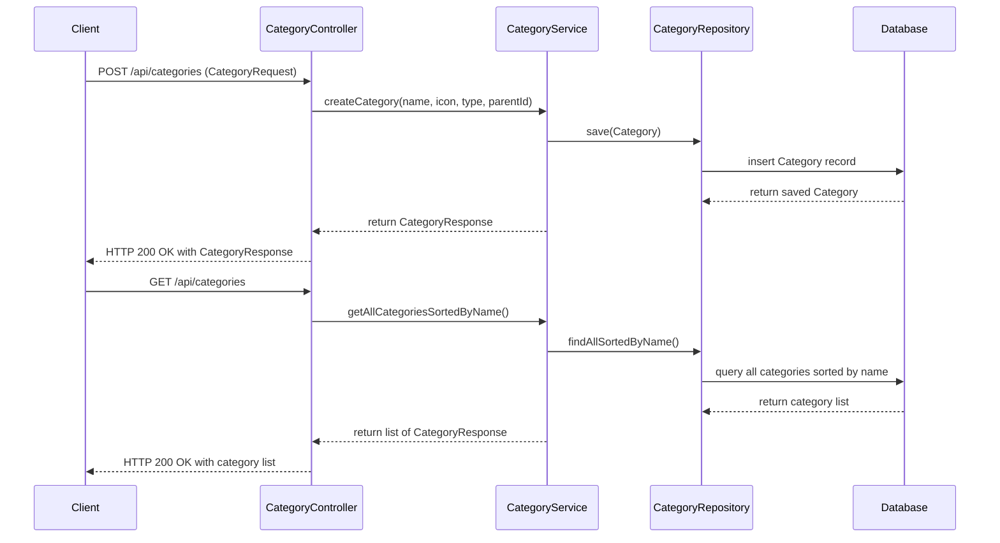

# Money Keeper Backend

## Running Tests in Parallel

This project uses Maven and JUnit 5 for testing. To run tests in parallel, the following configurations have been applied:

### Maven Surefire Plugin Configuration

The `pom.xml` includes the Maven Surefire plugin configured to run tests in parallel at the class level with 4 threads:

```xml
<plugin>
    <groupId>org.apache.maven.plugins</groupId>
    <artifactId>maven-surefire-plugin</artifactId>
    <version>3.0.0-M7</version>
    <configuration>
        <parallel>classes</parallel>
        <threadCount>4</threadCount>
        <forkCount>1C</forkCount>
        <reuseForks>true</reuseForks>
    </configuration>
</plugin>
```

### JUnit 5 Parallel Execution Configuration

JUnit 5 parallel execution is enabled via the `src/test/resources/junit-platform.properties` file with the following settings:

```
junit.jupiter.execution.parallel.enabled = true
junit.jupiter.execution.parallel.mode.default = same_thread
junit.jupiter.execution.parallel.mode.classes.default = concurrent
```

This configuration runs test classes in parallel while test methods within a class run sequentially.

## Postman Collection for API Testing

A Postman collection file `postman_collection.json` is provided to test the Category API endpoints. It includes:

- Create Category (POST `/api/categories`)
- Get All Categories Sorted By Name (GET `/api/categories`)

The collection includes an environment variable `baseUrl` which should be set to your API base URL (default is `http://localhost:8080`).

## How to Run Tests

Run the following command to execute tests with parallel execution enabled:

```bash
mvn test
```

## How to Use Postman Collection

1. Import `postman_collection.json` into Postman.
2. Set the `baseUrl` environment variable to your API base URL.
3. Use the provided requests to test the API endpoints.

---

## Running Unit and Integration Tests Separately

This project uses Maven profiles to separate unit and integration tests based on naming conventions.

### Run Unit Tests (Small Tests)

Run the following command to execute unit tests (tests matching `**/*Test.java` excluding `**/*IntegrationTest.java`):

```
mvn test -Psmall-test
```

### Run Integration Tests (Medium Tests)

Run the following command to execute integration tests (tests matching `**/*IntegrationTest.java`):

```
mvn failsafe:integration-test failsafe:verify -Pmedium-test
```

### Run All Tests

To run both unit and integration tests together, use:

```
mvn verify
```

Note: This will run unit tests first, then integration tests.

---

## Project Architecture

This project follows a Domain-Driven Design (DDD) approach with a layered architecture:

- **Domain Layer:** Contains the core business logic and domain models (e.g., `Category`, `CategoryType`).
- **Application Layer:** Contains services that orchestrate domain operations (e.g., `CategoryService`).
- **Infrastructure Layer:** Handles persistence and external system interactions (e.g., JPA repositories, database entities).
- **Interface Layer:** Exposes RESTful APIs for clients (e.g., `CategoryController`).

## Sequence Diagram

Below is a simplified sequence diagram illustrating the flow of creating a new category and retrieving all categories via the API in Mermaid format:



---

If you need further assistance or additional features, please let me know.
To run both unit and integration tests together, use:

mvn failsafe:integration-test failsafe:verify -Pmedium-test
mvn test -Psmall-test
mvn test
junit.jupiter.execution.parallel.mode.classes.default = concurrent
JUnit 5 parallel execution is enabled via the `src/test/resources/junit-platform.properties` file with the following settings:

