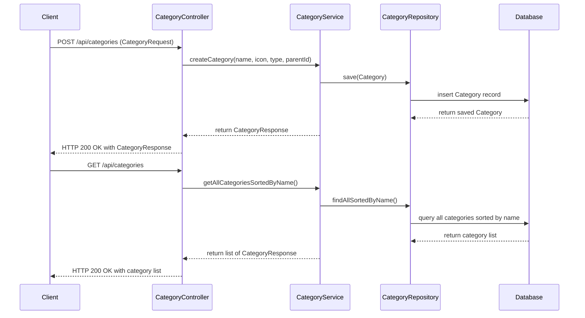

# Money Keeper Backend

## Running Tests in Parallel

This project uses Maven and JUnit 5 for testing. To run tests in parallel, the following configurations have been applied:

### Maven Surefire Plugin Configuration

The `pom.xml` includes the Maven Surefire plugin configured to run tests in parallel at the class level with 4 threads:

```xml
<plugin>
    <groupId>org.apache.maven.plugins</groupId>
    <artifactId>maven-surefire-plugin</artifactId>
    <version>3.0.0-M7</version>
    <configuration>
        <parallel>classes</parallel>
        <threadCount>4</threadCount>
        <forkCount>1C</forkCount>
        <reuseForks>true</reuseForks>
    </configuration>
</plugin>
```

### JUnit 5 Parallel Execution Configuration

JUnit 5 parallel execution is enabled via the `src/test/resources/junit-platform.properties` file with the following settings:

```
junit.jupiter.execution.parallel.enabled = true
junit.jupiter.execution.parallel.mode.default = same_thread
junit.jupiter.execution.parallel.mode.classes.default = concurrent
```

This configuration runs test classes in parallel while test methods within a class run sequentially.

## Postman Collection for API Testing

A Postman collection file `postman_collection.json` is provided to test the Category API endpoints. It includes:

- Create Category (POST `/api/categories`)
- Get All Categories Sorted By Name (GET `/api/categories`)

The collection includes an environment variable `baseUrl` which should be set to your API base URL (default is `http://localhost:8080`).

## How to Run Tests

Run the following command to execute tests with parallel execution enabled:

```bash
mvn test
```

## How to Use Postman Collection

1. Import `postman_collection.json` into Postman.
2. Set the `baseUrl` environment variable to your API base URL.
3. Use the provided requests to test the API endpoints.

---

## Running Unit and Integration Tests Separately

This project uses Maven profiles to separate unit and integration tests based on naming conventions.

### Run Unit Tests (Small Tests)

Run the following command to execute unit tests (tests matching `**/*Test.java` excluding `**/*IntegrationTest.java`):

```
mvn test -Psmall-test
```

### Run Integration Tests (Medium Tests)

Run the following command to execute integration tests (tests matching `**/*IntegrationTest.java`):

```
mvn failsafe:integration-test failsafe:verify -Pmedium-test
```

### Run All Tests

To run both unit and integration tests together, use:

```
mvn verify
```

Note: This will run unit tests first, then integration tests.

---

## Project Architecture

This project follows a Domain-Driven Design (DDD) approach with a layered architecture:

- **Domain Layer:** Contains the core business logic and domain models (e.g., `Category`, `CategoryType`).
- **Application Layer:** Contains services that orchestrate domain operations (e.g., `CategoryService`).
- **Infrastructure Layer:** Handles persistence and external system interactions (e.g., JPA repositories, database entities).
- **Interface Layer:** Exposes RESTful APIs for clients (e.g., `CategoryController`).

## Sequence Diagram

Below is a simplified sequence diagram illustrating the flow of creating a new category and retrieving all categories via the API in Mermaid format:



---

## API Error Response Update

The API now returns structured error responses for category-related errors to facilitate easier client-side handling. The error response format is as follows:

```json
{
  "timestamp": "2024-06-01T12:34:56.789",
  "status": 409,
  "error": "Conflict",
  "message": "Category has child categories and cannot be deleted."
}
```

### Error Cases

- **CategoryNotFoundException**: Returns HTTP 404 Not Found with a structured error message.
- **CategoryHasChildException**: Returns HTTP 409 Conflict when attempting to delete a category that has child categories.
- **CategoryCyclicDependencyException**: Returns HTTP 409 Conflict for cyclic dependency errors.
- **CategoryConflictException**: Returns HTTP 409 Conflict for other category conflicts.

### Important Notes

- Deleting a category with child categories is not allowed and will result in a `CategoryHasChildException` with a structured error response.
- Clients should handle these structured error responses accordingly.

Please update your client applications to handle these structured error responses.

---

## Building and Running the Backend Locally

To build and run the backend locally, you can use the provided Dockerfile or run the application directly with Maven.

### Using Docker

1. Ensure Docker is installed and running.
2. Build the Docker image:

```bash
docker build -t money-keeper-backend ./backend
```

3. Run the Docker container, setting the Oracle password as an environment variable:

```bash
docker run -e ORACLE_PASSWORD=your_password -p 8080:8080 money-keeper-backend
```

The container will:
- Download and install Oracle Instant Client.
- Build the backend application.
- Wait for the Oracle database to be ready.
- Reset the Oracle system user password using the provided `ORACLE_PASSWORD`.
- Start the backend server on port 8080.

### Running with Maven

1. Set the `ORACLE_PASSWORD` environment variable in your shell:

```bash
export ORACLE_PASSWORD=your_password
```

2. Run the backend application:

```bash
cd backend
mvn spring-boot:run
```

---

## Secrets Management

The backend requires the Oracle system user password to connect to the Oracle database. This password should be provided via the `ORACLE_PASSWORD` environment variable.

- When running the backend in Docker, pass the password using the `-e ORACLE_PASSWORD=your_password` flag.
- When running locally with Maven, export the environment variable before starting the application.
- Ensure this password is kept secure and not hardcoded in any files or scripts.

---

## Handling Oracle Setup Failures

The backend includes a script `wait-for-oracle.sh` that waits for the Oracle database to be ready before starting the application.

- The script retries the connection every 5 seconds (configurable via `RETRY_INTERVAL`) up to 60 times (configurable via `MAX_RETRIES`).
- If the Oracle database is not ready after the maximum retries, the script exits with an error, and the backend startup will fail.
- In case of failure:
  - Check the Oracle database container logs for errors.
  - Ensure the Oracle database container is running and accessible.
  - Restart the Oracle container if necessary.
  - Verify the `ORACLE_PASSWORD` environment variable is set correctly and matches the Oracle system user password.
- You can adjust retry intervals and max retries by setting the `RETRY_INTERVAL` and `MAX_RETRIES` environment variables when running the container or script.

---

If you need further assistance or additional documentation, please reach out to the development team.
mvn spring-boot:run
docker run -e ORACLE_PASSWORD=your_password -p 8080:8080 money-keeper-backend
docker build -t money-keeper-backend ./backend

mvn failsafe:integration-test failsafe:verify -Pmedium-test
junit.jupiter.execution.parallel.mode.classes.default = concurrent

If you need further assistance or additional features, please let me know.
To run both unit and integration tests together, use:

mvn failsafe:integration-test failsafe:verify -Pmedium-test
mvn test -Psmall-test
mvn test
junit.jupiter.execution.parallel.mode.classes.default = concurrent
JUnit 5 parallel execution is enabled via the `src/test/resources/junit-platform.properties` file with the following settings:

