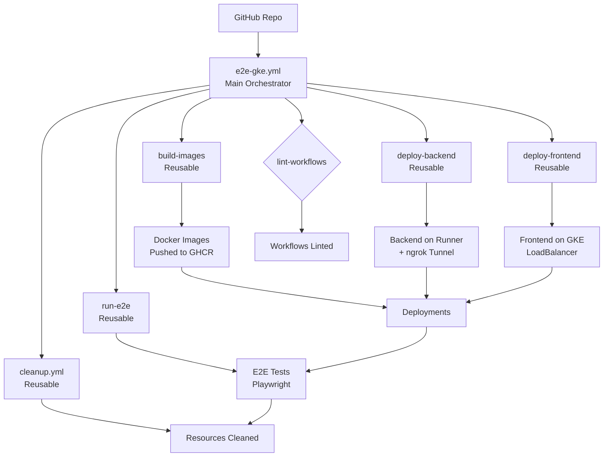
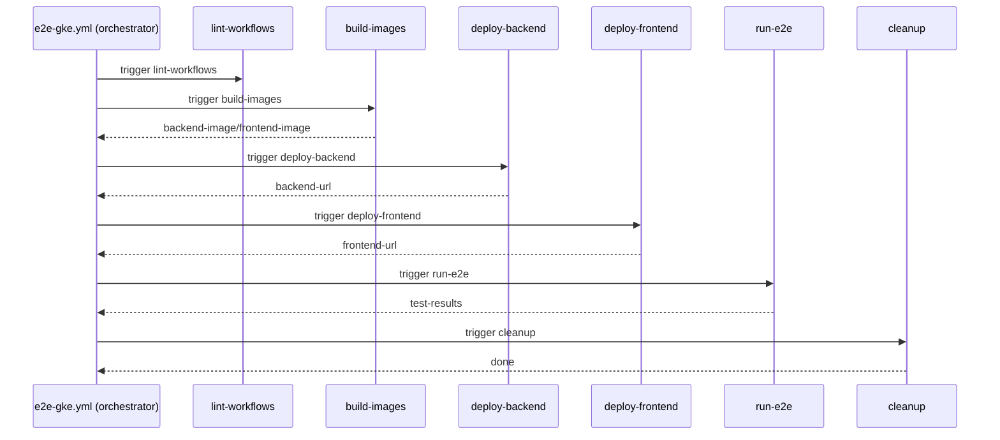
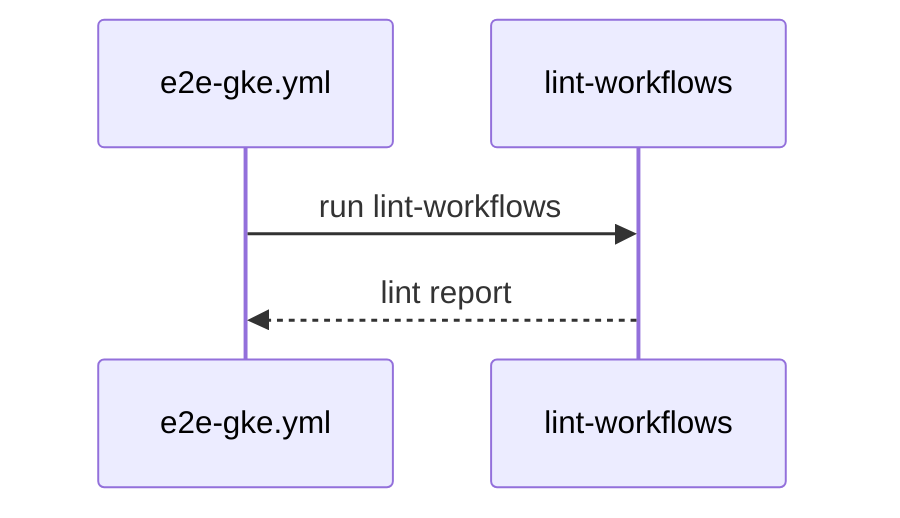
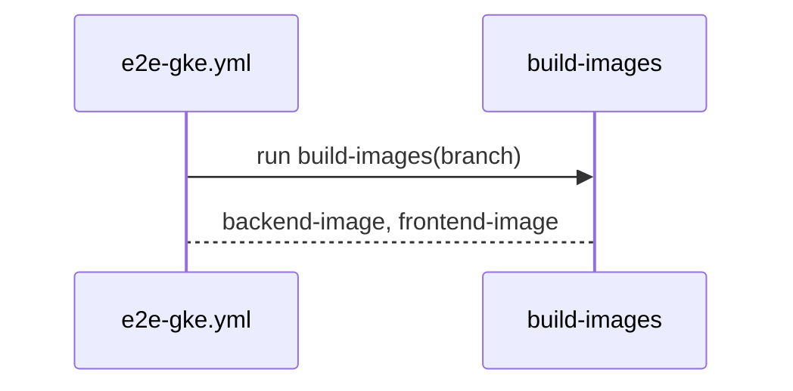
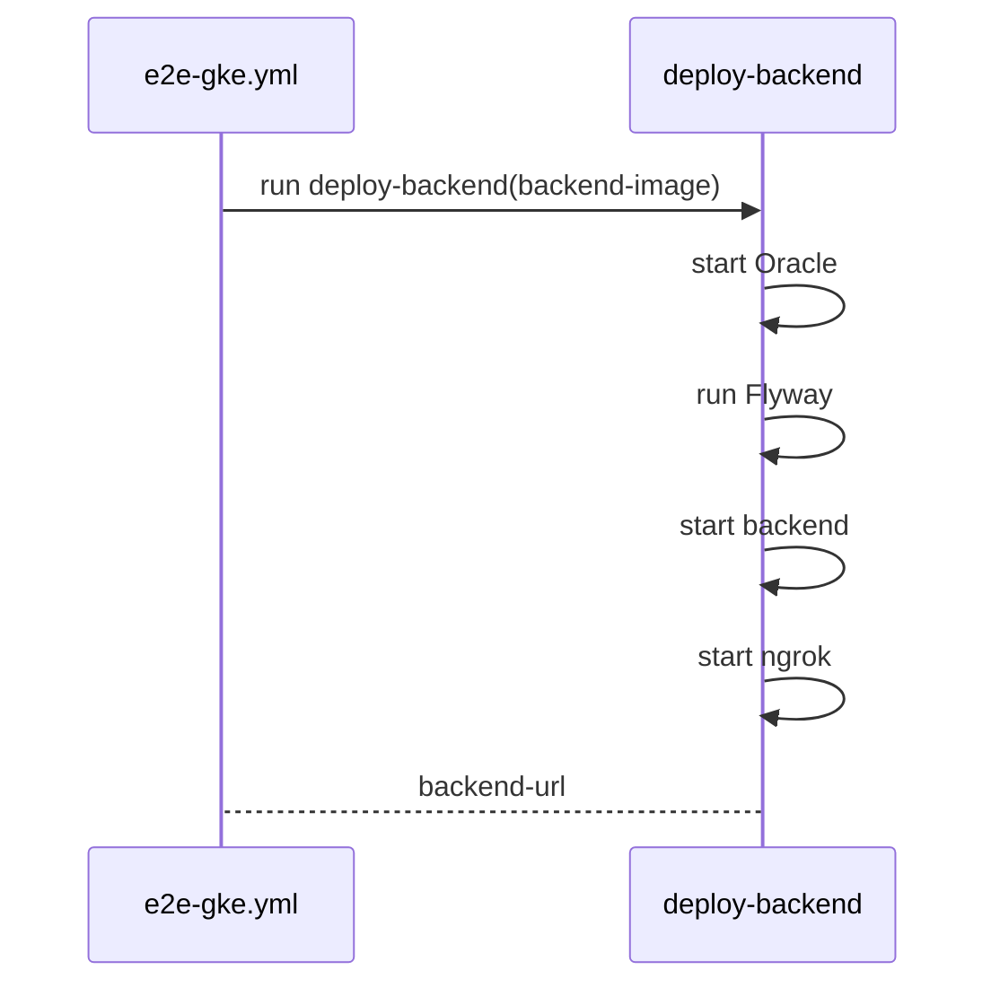
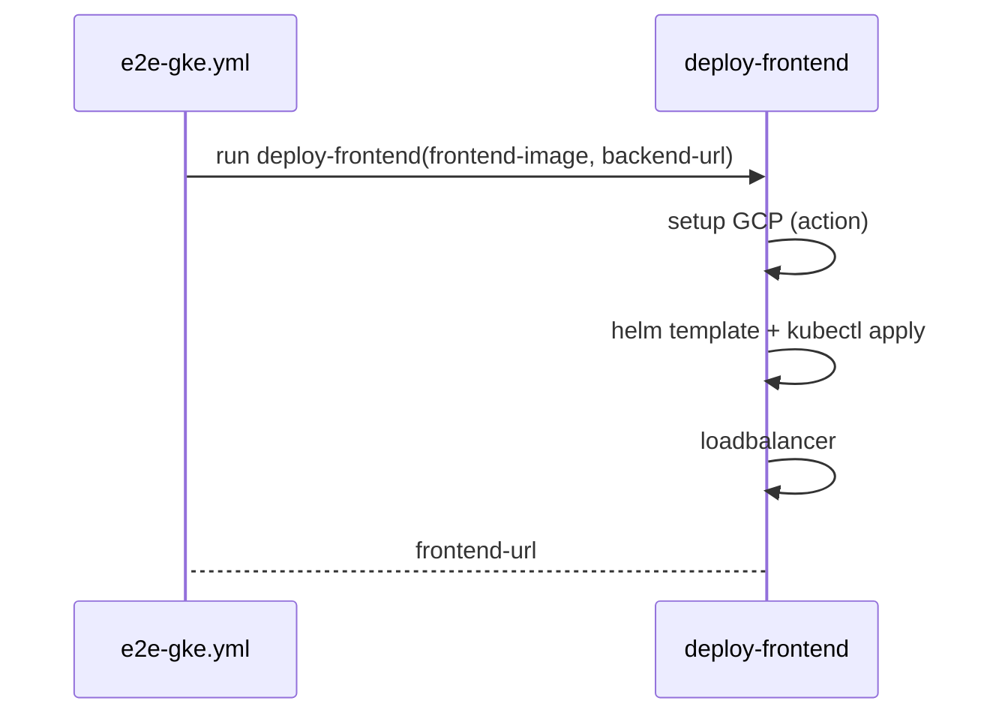
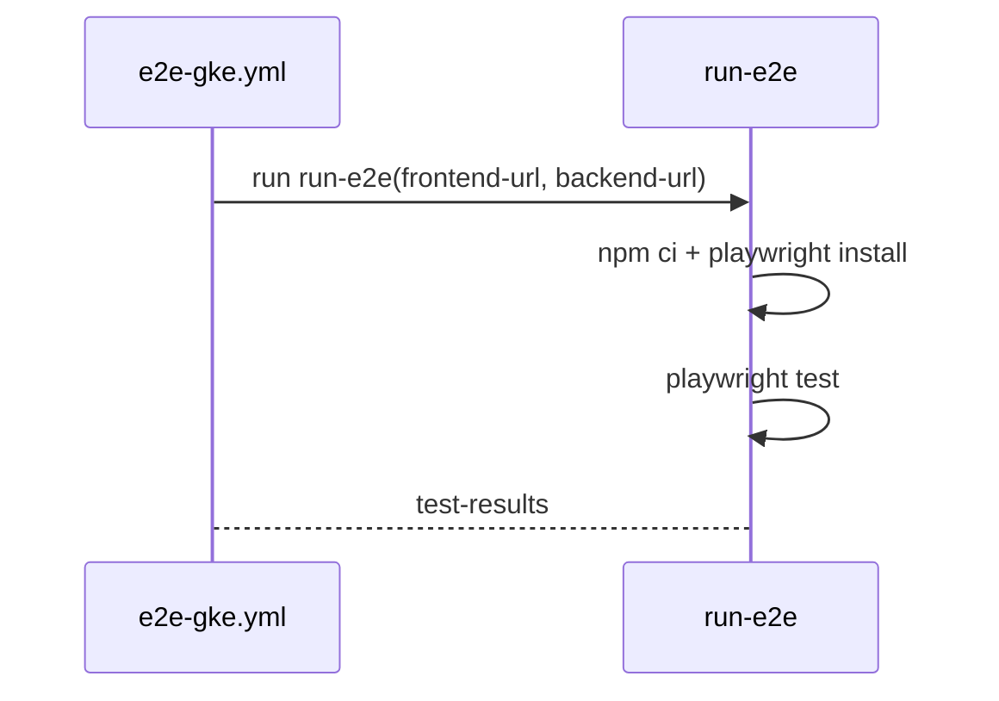
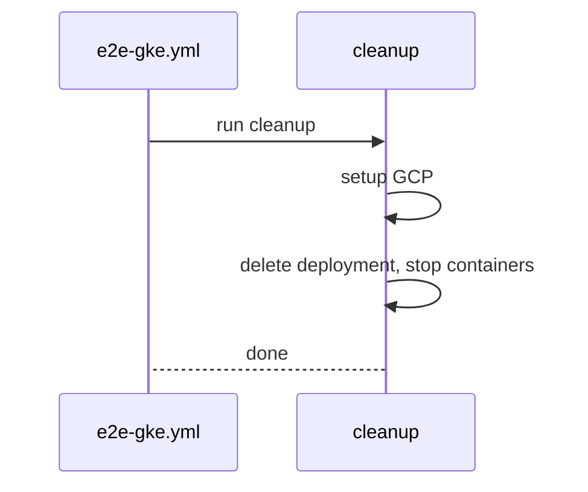

# CI/CD Design for Money Keeper

## Table of Contents
- [Introduction](#introduction)
- [CI/CD Overview](#cicd-overview)
- [Pipeline Architecture](#pipeline-architecture)
- [Workflows Description](#workflows-description)
- [Best Practices Applied](#best-practices-applied)
- [Setup Guide](#setup-guide)
- [Security Considerations](#security-considerations)
- [Monitoring & Troubleshooting](#monitoring--troubleshooting)
- [Future Enhancements](#future-enhancements)

## Introduction
This document outlines the CI/CD pipeline design for the Money Keeper project, a full-stack financial management application. The pipeline ensures reliable, secure, and efficient delivery of code changes through automated testing, building, and deployment.

**Tech Stack:**
- Backend: Spring Boot (Java)
- Frontend: Vue 3 + Vite
- E2E Testing: Playwright + Cucumber (TypeScript)
- Infrastructure: Docker, Kubernetes (GKE), Helm
- CI/CD: GitHub Actions

## CI/CD Overview
The CI/CD pipeline is designed for:
- **Continuous Integration**: Automated linting, building, and unit testing on code changes.
- **Continuous Deployment**: Manual-triggered E2E testing with deployment to staging-like environments.
- **Quality Gates**: Linting, testing, and artifact management.
- **Scalability**: Modular design with reusable components.

### Pipeline Flow
```
Code Push/Merge → Lint → Build Images → Deploy Backend (Runner) → Deploy Frontend (GKE) → Run E2E Tests → Cleanup
```

- **Trigger**: Manual (`workflow_dispatch`) to avoid auto-deploy on every push.
- **Environments**: GitHub runners for backend, GKE for frontend.
- **Testing**: E2E tests run against deployed apps.

## Pipeline Architecture
The pipeline uses a modular architecture for maintainability and reusability.

### Components
- **Main Workflow**: `e2e-gke.yml` - Orchestrates the full pipeline.
- **Reusable Workflows**:
  - `build-images.yml`: Builds Docker images.
  - `deploy-backend.yml`: Deploys backend to runner.
  - `deploy-frontend.yml`: Deploys frontend to GKE.
  - `run-e2e.yml`: Executes E2E tests.
  - `cleanup.yml`: Cleans up resources.
- **Composite Actions**:
  - `setup-gcp`: Handles GCP authentication and K8s setup.
- **Helm Chart**: `k8s/` for templated K8s deployments.

### Architecture Diagram


- **Benefits**: Separation of concerns, easy testing/debugging, DRY principle.

## Workflows Description

### e2e-gke.yml (Main Workflow)
- **Purpose**: Full E2E pipeline orchestration.
- **Trigger**: Manual with branch input.
- **Features**: Concurrency control, timeouts, secrets inheritance.

#### Sequence Diagram (Job dependency)


- **Jobs**:
  1. `lint-workflows`: Lint all workflows/actions with actionlint.
     - runs first in parallel to provide early quality feedback.



  2. `build-images`: Calls `build-images.yml` reusable workflow.
     - checkout branch, set up buildx, login registry, build and push backend+frontend images.
     - outputs: `backend-image`, `frontend-image`.



  3. `deploy-backend`: Calls `deploy-backend.yml` reusable workflow (needs build-images).
     - checkout branch, start Oracle, run Flyway migration, start backend container, create ngrok tunnel.
     - output: `backend-url`.



  4. `deploy-frontend`: Calls `deploy-frontend.yml` reusable workflow (needs build-images + deploy-backend).
     - checkout branch, setup GCP action, install Helm, render chart with provided image/backend-url, deploy and expose load balancer.
     - output: `frontend-url`.



  5. `run-e2e`: Calls `run-e2e.yml` reusable workflow (needs deploy-backend + deploy-frontend).
     - checkout branch, setup node, cache npm, install deps, install playwright browsers, execute tests, upload reports.



  6. `cleanup`: Calls `cleanup.yml` reusable workflow (needs run-e2e, always).
     - checkout branch, setup GCP action, delete frontend deployment, stop ngrok/backend containers.



### Reusable Workflows
- **build-images.yml**: Builds/pushes backend & frontend images using Docker Buildx.
- **deploy-backend.yml**: Starts Oracle DB, runs Flyway migrations, starts backend container, tunnels with ngrok.
- **deploy-frontend.yml**: Uses Helm to template and deploy to GKE, patches service to LoadBalancer.
- **run-e2e.yml**: Sets up Node.js, installs deps (with cache), runs Playwright tests.
- **cleanup.yml**: Authenticates GCP, deletes K8s resources, stops containers.

### Custom Action
- **setup-gcp**: Composite action for GCP auth, gcloud setup, and kubectl config.

## Best Practices Applied
- **Modularity**: Reusable workflows and actions reduce duplication.
- **Security**: Secrets for credentials, minimal permissions, no hardcodes.
- **Performance**: Caching (npm), concurrency cancellation, timeouts.
- **Reliability**: Error handling, always cleanup, linting.
- **Scalability**: Helm templating, vars for config.
- **Observability**: Artifacts for test reports, structured logging.
- **Compliance**: Pinned action versions, documented processes.

## Setup Guide

### Prerequisites
- GitHub repository with Actions enabled.
- GCP project with GKE cluster.
- Docker Hub or GHCR access.
- Ngrok account for tunneling.

### Repository Configuration
1. **Variables** (Settings > Variables):
   - `GKE_CLUSTER`: e.g., `my-cluster`
   - `GKE_ZONE`: e.g., `us-central1-a`

2. **Secrets** (Settings > Secrets):
   - `GCP_SA_KEY`: JSON key for GCP service account.
   - `ORACLE_PASSWORD_SECRET`: Password for Oracle DB.
   - `NGROK_AUTH_TOKEN`: Ngrok auth token.

3. **Permissions**: Ensure service account has GKE admin, storage admin roles.

### Workflow Execution
1. Go to Actions tab > "E2E Test with Frontend on GKE and Backend on Runner".
2. Click "Run workflow", select branch (default: develop).
3. Monitor jobs: Lint → Build → Deploy → Test → Cleanup.

### Helm Setup
- Chart in `k8s/`: Update `values.yaml` if needed.
- Ensure image pull secrets in GKE for GHCR.

## Security Considerations
- **Secrets Management**: Use GitHub secrets, rotate regularly.
- **Access Control**: Least privilege for service accounts.
- **Network Security**: ngrok for temporary access, use HTTPS.
- **Vulnerability Scanning**: Scan images with Trivy (future).
- **Audit Logs**: GitHub Actions logs for compliance.

## Monitoring & Troubleshooting
- **Logs**: Check job logs in Actions tab.
- **Artifacts**: Download test reports from artifacts.
- **Timeouts**: Jobs timeout if stuck (e.g., DB wait).
- **Common Issues**:
  - GCP auth fails: Check SA key and permissions.
  - K8s deploy fails: Verify cluster/zone vars.
  - Tests fail: Check BASE_URL/API_BASE_URL in logs.
- **Alerts**: Use GitHub notifications or integrate with Slack.

## Future Enhancements
- **Multi-Environment**: Add prod deployment with approvals.
- **Parallel Testing**: Split E2E tests across runners.
- **Blue-Green Deployment**: For zero-downtime on GKE.
- **IaC**: Use Terraform for infra provisioning.
- **Metrics**: Integrate with Prometheus/Grafana.
- **Auto-Scaling**: HPA for K8s deployments.

---

This design ensures a robust, maintainable CI/CD pipeline. For questions or updates, refer to the workflows in `.github/workflows/`. 🚀