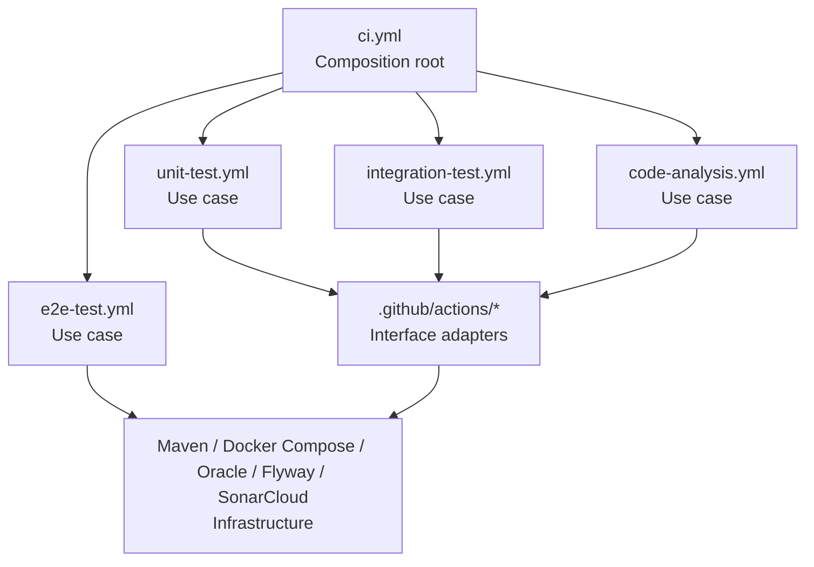
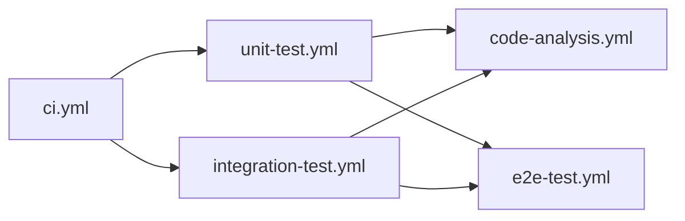

# CI Workflow Architecture

This document describes the architecture of the Money Keeper backend CI workflows.
The goal is to keep CI easy to understand, change, and extend while keeping all
workflow ownership inside the `money-keeper` repository.

## Design Goals

- Keep `ci.yml` as the single push/pull-request entrypoint for CI.
- Model each CI capability as a small reusable workflow.
- Keep platform-specific implementation details inside local composite actions.
- Avoid dependency on the former external `cloud-workflow` repository.
- Avoid duplicate CI runs from child workflows.

## Architecture Layers

The CI design follows a clean architecture style:

| Layer | Responsibility | Files |
| --- | --- | --- |
| Composition root | Defines the high-level CI flow and job dependencies. | `.github/workflows/ci.yml` |
| Use cases | Encapsulate one CI capability. | `unit-test.yml`, `integration-test.yml`, `code-analysis.yml`, `e2e-test.yml` |
| Interface adapters | Convert workflow intent into tool-specific steps. | `.github/actions/*` |
| Infrastructure | External tools and services. | GitHub Actions, Maven, Docker Compose, Oracle, Flyway, SonarCloud |

Dependency direction is one-way:



## Main Pipeline

`ci.yml` is the only CI workflow that runs automatically on `push` and
`pull_request`. It does not contain implementation steps. It only composes
reusable workflows:



### Entry Point

File: `.github/workflows/ci.yml`

Responsibilities:

- Trigger backend CI on `push`, `pull_request`, `workflow_dispatch`, and
  `workflow_call`.
- Call the reusable unit test workflow.
- Call the reusable integration test workflow.
- Run code analysis after unit and integration tests complete successfully.
- Run E2E tests after unit and integration tests complete successfully.

Non-responsibilities:

- It does not install Java.
- It does not run Maven commands directly.
- It does not start Oracle or Flyway directly.
- It does not call SonarCloud directly.

## Reusable Workflows

### Unit Test Workflow

File: `.github/workflows/unit-test.yml`

Triggers:

- `workflow_call`
- `workflow_dispatch`

Responsibilities:

- Checkout source code.
- Prepare the Java/Maven toolchain.
- Run the Maven unit test profile.
- Publish unit test reports and JaCoCo artifacts.

Key local actions:

- `.github/actions/setup-java-maven`
- `.github/actions/run-maven-tests`
- `.github/actions/upload-test-artifacts`

### Integration Test Workflow

File: `.github/workflows/integration-test.yml`

Triggers:

- `workflow_call`
- `workflow_dispatch`

Responsibilities:

- Checkout source code.
- Prepare the Java/Maven toolchain.
- Start Oracle using Docker Compose.
- Run Flyway migrations.
- Run the Maven integration test profile.
- Publish integration test reports and JaCoCo artifacts.
- Tear down Docker Compose services.

Key local actions:

- `.github/actions/setup-java-maven`
- `.github/actions/setup-oracle-flyway`
- `.github/actions/run-maven-tests`
- `.github/actions/upload-test-artifacts`
- `.github/actions/teardown-docker-compose`

### Code Analysis Workflow

File: `.github/workflows/code-analysis.yml`

Triggers:

- `workflow_call`
- `workflow_dispatch`

Responsibilities:

- Checkout source code with full history for analysis.
- Prepare the Java/Maven toolchain.
- Download unit and integration JaCoCo artifacts from the current workflow run.
- Prepare the merged coverage report.
- Compile backend classes for analysis.
- Run the SonarCloud quality gate when Sonar secrets and variables are present.

Key local actions:

- `.github/actions/setup-java-maven`
- `.github/actions/merge-jacoco-reports`
- `.github/actions/run-sonar-scan`

Note: `workflow_dispatch` on `code-analysis.yml` is useful for debugging, but
coverage artifacts are normally available only when this workflow is called by
`ci.yml` after unit and integration tests have run.

### E2E Test Workflow

File: `.github/workflows/e2e-test.yml`

Triggers:

- `workflow_call`
- `workflow_dispatch`

Responsibilities:

- Checkout source code.
- Start Oracle and run Flyway migrations.
- Build and start backend/frontend services with Docker Compose.
- Run Playwright E2E tests from `playwright-code-gen`.
- Publish the Allure report to GitHub Pages.
- Tear down Docker Compose services.

Note: E2E is called by `ci.yml` after unit and integration tests pass. The
workflow remains manually runnable for debugging, but it does not trigger
automatically on push or pull request.

## Composite Actions

Composite actions are the infrastructure adapter layer. They keep reusable
workflow files focused on intent instead of tool commands.

| Action | Responsibility |
| --- | --- |
| `setup-java-maven` | Install JDK and configure Maven cache. |
| `run-maven-tests` | Run a Maven goal/profile pair and aggregate XML reports. |
| `setup-oracle-flyway` | Start Oracle, wait for readiness, and run Flyway. |
| `upload-test-artifacts` | Upload test reports and JaCoCo artifacts. |
| `merge-jacoco-reports` | Prepare one JaCoCo report directory for analysis. |
| `run-sonar-scan` | Run Maven SonarCloud analysis. |
| `teardown-docker-compose` | Stop Docker Compose services after integration tests. |
| `run-eslint` | Install npm dependencies and run a package lint script. |
| `prepare-e2e-stack` | Reuse database setup, build backend, and start app services for E2E. |
| `run-e2e-suite` | Run the Playwright E2E test command in Docker Compose. |
| `publish-allure-report` | Generate and publish the Allure report to GitHub Pages. |

## Trigger Policy

CI should run automatically from `ci.yml` only.

Reusable child workflows intentionally avoid `push` and `pull_request` triggers
to prevent duplicate runs:

```yaml
on:
  workflow_call:
  workflow_dispatch:
```

This preserves a single entrypoint while still allowing each workflow to be run
manually for debugging.

## Secrets and Variables

Required secrets:

- `ORACLE_PASSWORD_SECRET`: Oracle password used by integration tests.
- `SONAR_TOKEN`: SonarCloud token. If missing, the quality gate step is skipped.

Required variables:

- `SONAR_PROJECT_KEY`: Sonar project key. If missing, the quality gate step is
  skipped.
- `SONAR_ORGANIZATION`: Optional SonarCloud organization.

## Artifact Contract

The analysis workflow depends on artifact names produced by test workflows:

| Producer | Artifact | Consumer |
| --- | --- | --- |
| `unit-test.yml` | `jacoco-report-unit` | `code-analysis.yml` |
| `integration-test.yml` | `jacoco-report-integration` | `code-analysis.yml` |
| `unit-test.yml` | `surefire-report-unit` | Human/debugging |
| `integration-test.yml` | `surefire-report-integration` | Human/debugging |

When changing artifact names, update both the producer workflow and the
consumer workflow in the same change.

## Maintenance Rules

- Keep `ci.yml` free of shell commands and tool-specific setup.
- Put a new CI capability in a reusable workflow when it represents a business
  use case, such as testing, analysis, build, deploy, or release.
- Put repeated or tool-specific steps in a local composite action.
- Do not call workflows or actions from external repositories for internal CI
  behavior unless there is a clear reason and ownership is documented.
- Prefer passing inputs into actions over hard-coding values inside actions.
- Keep child workflows reusable and manually runnable, but not automatically
  triggered by push or pull request.

## Current File Map

```text
.github/
  workflows/
    ci.yml
    unit-test.yml
    integration-test.yml
    code-analysis.yml
    e2e-test.yml
  actions/
    setup-java-maven/
    run-maven-tests/
    setup-oracle-flyway/
    upload-test-artifacts/
    merge-jacoco-reports/
    run-sonar-scan/
    teardown-docker-compose/
    run-eslint/
    prepare-e2e-stack/
    run-e2e-suite/
    publish-allure-report/
```
