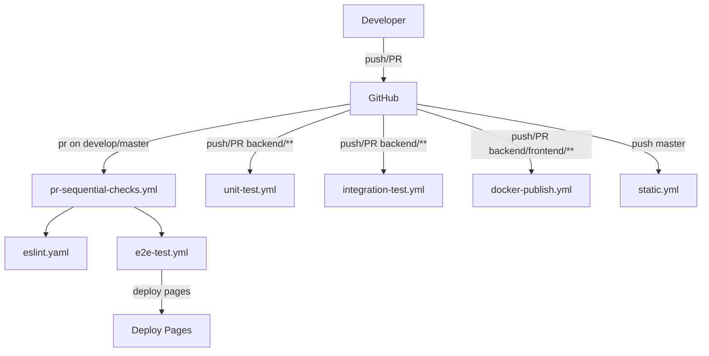
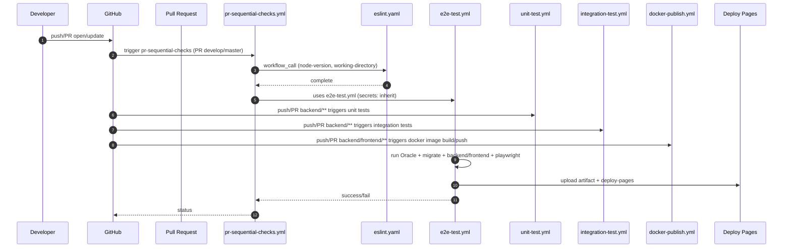

# CI/CD System Design Details

## 1) Architecture Overview

This repository uses a modular GitHub Actions architecture with Orchestrator (Caller) and Reusable Workflow (Callee) pattern.

### Key Roles
- **Developer**: pushes code / opens PR / triggers workflow_dispatch.
- **Orchestrator**: `pr-sequential-checks.yml` (for PR), calls reusable workflows in sequence.
- **Reusable Workflows**: `eslint.yaml`, `e2e-test.yml`, `integration-test.yml`, `unit-test.yml`, `docker-publish.yml`, `static.yml`.
- **GHCR**: container image registry used for docker images and local testing.
- **GCP**: Not currently implemented in these workflows (no gcloud, Workload Identity Federation, or explicit GCP deployment steps in actual YAML), but architecture can be extended.

### Trigger overview (push/PR behavior)
- `pull_request` on `develop/master` for backend/frontend/playwright triggers `pr-sequential-checks.yml`, which runs eslint + e2e.
- `push`/`pull_request` on backend paths triggers `unit-test.yml` and `integration-test.yml`.
- `push` on develop/master for backend/frontend/playwright triggers `e2e-test.yml` directly.
- `push` on master triggers `static.yml` for GitHub Pages deploy.
- `push`/`pull_request` on backend/frontend triggers `docker-publish.yml` to build/push Docker images.

### Trigger diagram (Mermaid)

### Sequence Diagram (Mermaid)

## 2) Interface Definitions (Reusable Workflows)

### 2.1 `eslint.yaml` (eslint-wrapper)

| Input | Type | Default | Required | Description |
|---|---|---|---|---|
| node-version | string | n/a | true | Node version for eslint host workflow
| working-directory | string | n/a | true | Path where eslint should run

| Secret | Description | Inherited? |
|---|---|---| 
| (none in this file) | No explicit secrets set | n/a |

| Output | Description |
|---|---|
| (none) | This workflow simply calls remote workflow and returns status.

### 2.2 `e2e-test.yml`

| Input | Type | Default | Required | Description |
|---|---|---|---|---|
| (none explicit) | - | - | - | Called as top-level and from orchestrator; no required inputs.

| Secret | Description | Inherited? |
|---|---|---|
| ORACLE_PASSWORD_SECRET | Oracle DB password from repo settings | n/a (direct secret reference) |
| GITHUB_TOKEN (implicit for pages) | For uploading pages artifacts and deploy actions | implicit |

| Output | Description |
|---|---|
| `deployment` job outputs `page_url` (used by environment URL in deploy-pages job) | URL of deployed GitHub Pages

### 2.3 `integration-test.yml`

| Input | Type | Default | Required | Description |
|---|---|---|---|---|
| (none) | - | - | - | External invocation or push triggers

| Secret | Description | Inherited? |
|---|---|---|
| ORACLE_PASSWORD_SECRET | Oracle DB password | direct usage |

| Output | Description |
|---|---|
| none | Standard exit status only

### 2.4 `unit-test.yml`

| Input | Type | Default | Required | Description |
|---|---|---|---|---|
| (none) | - | - | - | Works on push/pull_request and workflow_call

| Secret | Description | Inherited? |
|---|---|---|
| (none explicit) | No explicit secrets required (maven + container caching only) |

| Output | Description |
|---|---|
| none | Standard exit status only

---

## 3) Step-by-Step Implementation Logic

### 3.1 `pr-sequential-checks.yml` (Orchestrator)
1. Trigger: `pull_request` on develop/master for backend/frontend/playwright.
2. Runs job `eslint-check` by calling `./.github/workflows/eslint.yaml` with `node-version` and `working-directory`.
3. Uses `secrets: inherit` to pass repository secrets to child workflow.
4. On success, runs `e2e-test` by calling `./.github/workflows/e2e-test.yml` with inherited secrets.
5. This orchestrator ensures sequential dependency and early fail-fast.

### 3.1.1 Push/PR triggers outside orchestrator
- `unit-test.yml` runs on push/PR backend paths (develop/master).
- `integration-test.yml` runs on push/PR backend paths (develop/master).
- `e2e-test.yml` runs on push to develop/master for backend/frontend/playwright and workflow_call/workflow_run.
- `docker-publish.yml` runs on push/PR backend/frontend changes and manual dispatch.
- `static.yml` runs on push to master for docs deployment.

> Note: For stricter fail-fast in constrained runner environments, consider making `unit-test.yml` a required dependency of orchestrator before running `e2e-test`. This ensures test failures fail early.

### 3.2 `eslint.yaml` (Reusable wrapper)
1. Accepts required inputs `node-version`, `working-directory`.
2. Uses remote reusable workflow `samdofreelancer/cloud-workflow/.github/workflows/eslint.yml@main`.
3. Concurrency group per PR: `pr-${{ github.event.pull_request.number || github.ref }}-eslint` with cancel-in-progress true.

### 3.3 `e2e-test.yml` (Main run/test + GH Pages deploy)
1. Trigger: workflow_call, workflow_run from eslint-wrapper completed, push to develop/master, manual dispatch.
2. Set permissions: `contents: read`, `pages: write`, `id-token: write`.
3. Checkout with full fetch depth 0, flexible ref resolution.
4. Start Oracle with Docker Compose.
5. Run Flyway migration script with `ORACLE_PASSWORD_SECRET` and env `SPRING_DATASOURCE_URL`.
6. Build backend docker image locally with tag `ghcr.io/samdofreelancer/money-keeper-backend:${{ github.sha }}`.
7. Start backend and frontend containers in compose.
8. Wait for backend/frontend readiness via custom scripts.
9. Run playwright tests through compose service with environment propagation.
10. On failure, print backend/frontend logs.
11. Generate Allure report and zip artifact for upload.
12. Upload Allure artifact (`actions/upload-artifact@v4`) with retention-days.
13. Deploy GitHub Pages with `actions/deploy-pages@v4`.
14. Always cleanup containers with `docker compose down`.

> ✅ Recommendation: split these into reusable E2E sub-jobs if the workflow is long-running or fails often. E.g. `e2e-start-oracle`, `e2e-migrate`, `e2e-run-tests`, `publish-allure` so each step is independently visible and restartable.

### 3.4 `unit-test.yml` (Reusable unit test runner)
1. Trigger: push/pull_request/workflow_call.
2. Runs in Maven OpenJDK 18 container and mounts Maven cache volume.
3. Checkout code.
4. Setup Node 18 and install `xml2js` in `./backend/scripts`.
5. Cache Maven packages using `actions/cache` keyed by `backend/pom.xml` hash.
6. Run `mvn clean test -Psmall-test`.
7. Aggregate and upload Surefire report artifact.

### 3.5 `integration-test.yml` (Reusable integration test runner)
1. Trigger: workflow_call/workflow_dispatch/push/pull_request on backend paths.
2. Checkout code.
3. Start Oracle container.
4. Setup Node and run `npm install xml2js`.
5. Setup Java 17 with maven cache.
6. Run Flyway migration via `docker compose up flyway`.
7. Run `mvn clean verify -Pmedium-test -DskipUnitTests=true`.
8. Aggregate and upload reports, teardown compose.

### 3.6 `docker-publish.yml` (Image publication)
1. Trigger: push/pull_request on backend/frontend, or workflow_dispatch with input version.
2. Determine backend/frontend changes using `dorny/paths-filter`.
3. Login to GHCR with `docker/login-action@v2` using `GITHUB_TOKEN`.
4. Build and push backend/frontend images conditionally when changes are present.
5. Tag with input version and/or `github.sha` for immutable image versions (avoid only latest).

---

## 3.7 Production Readiness Refinements
1. Use immutable Docker tags in CI by SHA and/or semver, not latest.
2. Add Docker build cache with Buildx (`cache-from: type=gha`, `cache-to: type=gha`) to reduce repeated layer builds.
3. Add concurrency groups for deployment workflows (e.g. `deploy-production`) to avoid race conditions on parallel deploys.
4. Use GitHub OIDC + GCP Workload Identity Federation for production deploys instead of SA JSON keys.
5. Add job summary output (`GITHUB_STEP_SUMMARY`) for E2E pass/fail counts and artifact links.
6. Zip and upload Allure/Surefire reports with `actions/upload-artifact@v4` and retention days (e.g. `retention-days: 7`).

---

## 4) Best Practices Audit

### ✅ Current Good Practices in This Repo
- `id-token: write` and `contents: read` permission scopes are used in e2e for Pages deploy.
- `workflow_call` with reusable jobs is correctly in place for modular pipeline.
- `secrets: inherit` is used to propagate secrets to called workflows.
- Concurrency for eslint ensures single live run per PR branch and cancels stale runs.
- Maven and tool caches are configured in unit/integration tests.
- Docker Compose environment is cleaned up in `if: always()`.
---

## 5) Operation Guide (Manual Deploy / Rollback)

### Manual Deploy
1. Use `workflow_dispatch` on `e2e-test.yml` (or `docker-publish.yml` for image push) from GitHub Actions UI.
2. For environment-based deploy, update workflow inputs (e.g., version) and run dispatch.
3. If using GitHub Pages, commit to `main`/`master` under `docs/**` and let `deploy-pages.yml` run.

### Rollback
1. For GHCR image-based deployment (not yet in production workflow): redeploy with previous stable image tag.
2. If needed, use branch reversion commit and push to trigger PR pipeline again.
3. If using `pages`, rollback by deploying previous artifact manually via older run and `actions/upload-pages-artifact` from that run.

> [!IMPORTANT]
> The current pipeline does not include explicit `rollback` job. Implement production deployment workflow that receives `deploy-version` and `rollforward` variables, and runs `kubectl set image` or `az webapp deploy` using stable tags.

---

## 6) Quick Reference (Workflow Map)

- `pr-sequential-checks.yml`: orchestrator for PR flows, calls `eslint.yaml` and `e2e-test.yml`.
- `eslint.yaml`: reusable entry point for external eslint workflow.
- `e2e-test.yml`: core integration and E2E test plus GitHub Pages publishing.
- `unit-test.yml`: reusable unit test job with maven container and caching.
- `integration-test.yml`: reusable integration test job with Oracle and Flyway.
- `docker-publish.yml`: image build/push to GHCR for backend/frontend.
- `deploy-pages.yml`: deploy artifact to GitHub Pages.

---
