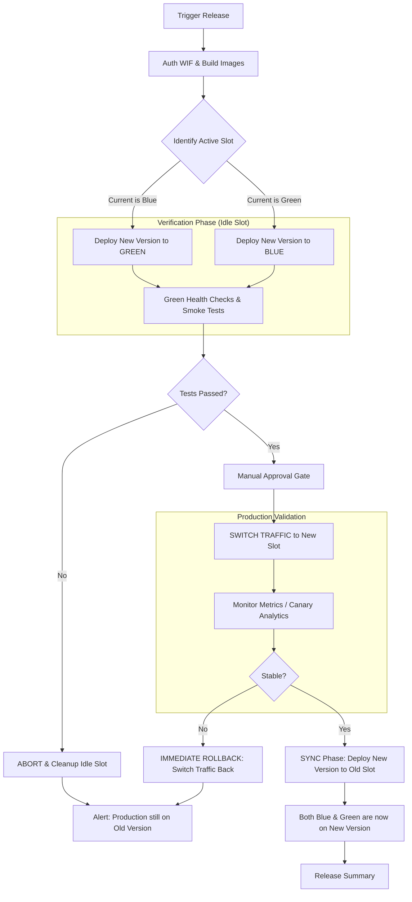
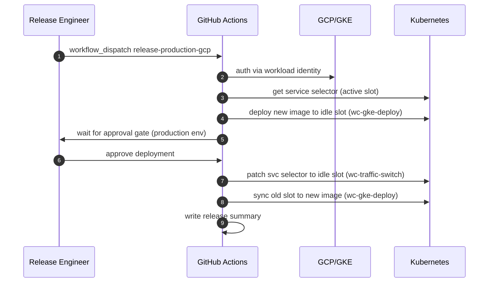
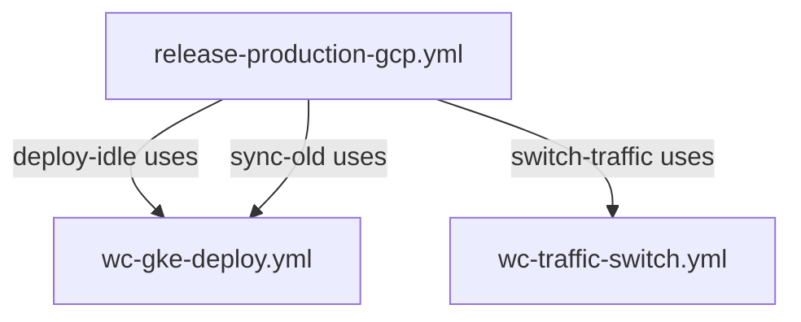
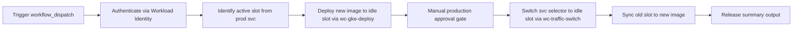

# Production Release to GCP (GKE)

This document describes the production release workflow for Money Keeper using GitHub Actions and GKE.

## 0) Workflow Name and Files
- Workflow name (top of YAML): `Release Production to GCP (Blue/Green)`
- Workflow file: `.github/workflows/release-production-gcp.yml`
- Reusable workflow deployments: `.github/workflows/wc-gke-deploy.yml`, `.github/workflows/wc-traffic-switch.yml`
- Rollback workflow file: `.github/workflows/rollback-production-gcp.yml`

## 1) Workflow Overview

Workflow file: `.github/workflows/release-production-gcp.yml`

Flow:
1. Manual trigger (`workflow_dispatch`) with release inputs.
2. Authenticate to GCP via Workload Identity Federation using `google-github-actions/auth@v1`.
3. Build and push backend/frontend images via `build-production-images.yml`.
4. Deploy to internal/test cluster and run health checks.
5. Deploy to production cluster with `environment: production`.
6. Run production health checks.
7. Emit release summary.

## 1.1) Flow Diagram



## 1.2) Sequence Diagram



## 2) Trigger Inputs

- `version`: image version tag (default: `${{ github.sha }}`).
- `release_backend`: boolean (default true).
- `release_frontend`: boolean (default true).
- `gcp_project`: GCP project ID (required).
- `internal_cluster`: internal/test GKE cluster name (required).
- `prod_cluster`: production GKE cluster name (required).
- `gke_location`: GKE zone/region (required).

## 3) Release Workflow Jobs

- `setup-gcp`: authenticate GCP and get internal kubeconfig.
- `build-images`: build and push backend/frontend images to GHCR via reusable workflow call to `.github/workflows/build-production-images.yml`.
- `deploy-internal`: deploy to internal cluster and rollout.
- `internal-healthcheck`: verify internal pods ready.
- `deploy-production`: deploy to production cluster (requires success of internal healthcheck), with environment gate.
- `production-healthcheck`: verify production pods ready.
- `release-summary`: output final release summary.

### Workflow call details

In `release-production-gcp.yml`, `build-images` is invoked as a reusable workflow step:

```yaml
  build-images:
    uses: ./.github/workflows/build-production-images.yml
    with:
      version: ${{ inputs.version }}
      build_backend: ${{ inputs.release_backend }}
      build_frontend: ${{ inputs.release_frontend }}
```

The build workflow accepts the same inputs and prints outputs:
- `backend_image`: GHCR backend image tag.
- `frontend_image`: GHCR frontend image tag.

Then the deploy steps use these outputs to set image in Kubernetes deployments.

## 3.1) Workflow YAML Calls in release-production-gcp.yml

In `.github/workflows/release-production-gcp.yml`, the reusable workflow files are called as steps in jobs:

- `deploy-idle` calls `uses: ./.github/workflows/wc-gke-deploy.yml` with inputs: `slot`, `image_tag`, `cluster_name`, `gcp_project`, `gke_location`.
- `switch-traffic` calls `uses: ./.github/workflows/wc-traffic-switch.yml` with inputs: `target_slot`, `cluster_name`, `gcp_project`, `gke_location`.
- `sync-old` calls `uses: ./.github/workflows/wc-gke-deploy.yml` again with the old slot and same image.

### Reusable workflow files and their purpose

- `.github/workflows/wc-gke-deploy.yml`: deploy backend/frontend image to the given slot and wait for rollout.
- `.github/workflows/wc-traffic-switch.yml`: patch `money-keeper-prod` service selector to route to the target slot.

### Workflow call diagram



## 3.2) Visual Release Diagram



## 4) Required Secrets

- `GCP_WORKLOAD_IDENTITY_PROVIDER`: OIDC provider resource name.
- `GCP_SERVICE_ACCOUNT`: service account email for GKE deploy.
- `GITHUB_TOKEN`: automatically available for GHCR login.

## 5) Best Practice Notes

- Keep image tags immutable from `version` input.
- Use GitHub environment protection for `production` to require approvals and avoid direct deploy without manual gate.
- Do not expose secrets in source code; keep secrets in GitHub repository secrets or environment secrets only.
- Use readyness/liveness probes in Kubernetes manifests.
- Keep deployment manifests in `k8s/` and avoid direct imperative config drift.

## 6) Rollback Strategy

For rollback, use the dedicated workflow `.github/workflows/rollback-production-gcp.yml` with a known good `version` image tag. This rollback deploys existing image tags directly without rebuilding the application.

### Rollback inputs
- `version`: existing image tag to roll back to.
- `rollback_backend`: boolean (default true).
- `rollback_frontend`: boolean (default true).
- `gcp_project`: GCP project ID.
- `prod_cluster`: production GKE cluster name.
- `gke_location`: GKE zone/region.
